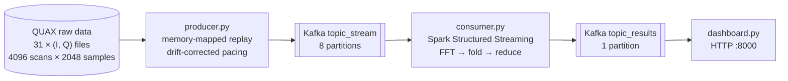

# quax-streaming

Real-time spectral analysis of raw detector data from the **QUAX** axion-search experiment, built as a streaming pipeline:
**Kafka → Spark Structured Streaming → live web dashboard**, running on a multi-VM CloudVeneto cluster.

A producer replays recorded I/Q scans at a fixed, configurable rate; a Spark cluster turns every micro-batch into an averaged power spectrum with per-bin uncertainty; a lightweight dashboard plots the latest and cumulative spectra in the browser.

---

## Architecture



| Component | Role |
|---|---|
| `producer.py` | Reads the I/Q files with `np.memmap`, packs 32 scans per message (512 KiB) and publishes to `topic_stream` on a precise schedule. |
| `consumer.py` | Spark job that computes FFT power spectra per message, aggregates them per partition and per micro-batch, and publishes mean and standard deviation per frequency bin to `topic_results`. |
| `dashboard.py` | Consumes `topic_results` and serves a self-refreshing plot: current batch (±1σ band) and cumulative average, log-scale power vs. frequency. |

---

## Data

- **31 file pairs** `duck_i_XXXXX.dat` / `duck_q_XXXXX.dat`, little-endian `float32`.
- Each file: **4096 scans × 2048 samples**. One I+Q file pair is **64 MiB**.
- ADC sampling rate **2 MS/s**, so spectra span **−1 MHz … +1 MHz** (2048 bins after `fftshift`).

Expected location: `../quax_data/` relative to the producer (`DATA_DIR` in `producer.py`).

---

## How it works

### Producer: rate-controlled replay

- **Memory-mapped input.** Loading all files with `np.fromfile` pinned ~2 GB of anonymous memory on a swapless VM, and the OOM killer terminated the process under broker pressure. `np.memmap` keeps the same indexing while the pages stay file-backed and evictable.
- **Batched messages.** Each message carries `SCANS_PER_MSG = 32` scans (all I, then all Q), i.e. 512 KiB, below Kafka's 1 MiB default message limit. The key is `"{file}_{message}"`.
- **Drift-corrected pacing.** Messages are scheduled against an absolute clock (`perf_counter`): message *n* should go out at `t0 + n·DT`, and the producer only sleeps the remaining difference. After each file's `flush()`, the origin is shifted forward by any overrun, so time lost to flushing doesn't trigger a burst at the start of the next file.
- **Live diagnostics.** Per file it reports the actual file time, the timing error relative to the target, the throughput in MB/s and the fraction of messages that had to be paced.

`TIME_INTERVAL` (seconds per 64 MiB file) sets the rate:

| `TIME_INTERVAL` | Target throughput |
|---|---|
| `4` (default) | ~16 MiB/s |
| `0.25` | ~256 MiB/s |

### Consumer: two-stage Spark aggregation

For each micro-batch (up to 1024 messages across 8 Kafka partitions):

1. **`message_partials`** (vectorised pandas UDF). Decodes each message into a `(32, 2048)` complex signal, computes the FFT power spectrum per scan, and emits the per-bin sums **ΣP** and **ΣP²** over the 32 scans. Malformed messages are skipped instead of crashing the job.
2. **`fold_partition`** (`mapInPandas`). Sums all partial arrays within a Spark partition, giving one row per partition (8 rows).
3. **`process_batch`** (`foreachBatch`). An `rdd.fold` adds the 8 rows on the driver, with no shuffle and no dummy grouping key, then computes per-bin **mean** and **standard deviation** and writes one JSON message to `topic_results`. `fold` is used instead of `reduce` so empty micro-batches are handled safely.

Because ΣP, ΣP² and the scan count are plain sums, the whole aggregation is associative, which is what makes the map → fold → reduce structure possible.

**Tuning for sustained high throughput:**

| Setting | Value | Why |
|---|---|---|
| `spark.sql.execution.arrow.maxRecordsPerBatch` | 64 | ~32 MiB of payload per Arrow batch. The default (10 000) would be ~5 GiB and run out of memory. |
| `maxOffsetsPerTrigger` | 1024 | When Spark falls behind, batches grow to the cap; 2048-message batches (~1 GiB) exhausted executor heap. |
| `spark.executor.memory` | 1500m | Headroom for full-size batches at peak rate. |
| `kafka.max.partition.fetch.bytes` | 32 MiB | ~64 messages per fetch. |
| `startingOffsets` | `latest` | This is a live monitor: after a restart we want current spectra, not a replay of a stale backlog. |
| `forceDeleteTempCheckpointLocation` | `true` | No persistent checkpoint, for the same reason. |
| `spark.locality.wait` | 0 | Schedule on any free core immediately. |

### Dashboard

Two threads: one consumes `topic_results` and keeps the latest batch plus a running, scan-weighted cumulative average; the other serves an HTML page that reloads the plot every 2 s. The shaded band is the standard error of the batch mean (σ/√n).

---

## Performance

- The network between CloudVeneto VMs, measured with `iperf3`, is **~250 MiB/s on one TCP connection** and **~640 MiB/s with 8 parallel connections**.
- The producer sustains **~250 MiB/s** (`TIME_INTERVAL = 0.25`), i.e. the single-connection network ceiling, while keeping per-file timing error to a fraction of a percent.
- On its own, the producer can pace files down to ~0.10 s (~640 MiB/s) without degradation; the network is the bottleneck, not the code.

---

## Setup

### Requirements

- Python 3 with `numpy`, `pandas`, `pyarrow`, `matplotlib`, `kafka-python`, `pyspark` (4.1.x)
- Apache Kafka broker
- Apache Spark standalone cluster (the consumer pulls `org.apache.spark:spark-sql-kafka-0-10_2.13:4.1.1` automatically)

> **Note:** addresses and paths are currently hard-coded for our cluster: Kafka broker `10.67.22.111:9092`, Spark master `spark://master:7077`, Python environment `/home/ubuntu/pyvenv`. Adjust them at the top of each script.

### Kafka topics

Created once, out of band. The short retention and small segments keep disk usage bounded at high throughput:

```bash
$KAFKA_HOME/bin/kafka-topics.sh --bootstrap-server 10.67.22.111:9092 \
  --create --topic topic_stream --partitions 8 --replication-factor 1 \
  --config retention.ms=600000 --config retention.bytes=134217728 \
  --config segment.bytes=33554432 --config segment.ms=1000 \
  --config file.delete.delay.ms=1000

$KAFKA_HOME/bin/kafka-topics.sh --bootstrap-server 10.67.22.111:9092 \
  --create --topic topic_results --partitions 1 --replication-factor 1 \
  --config retention.ms=600000 --config retention.bytes=134217728 \
  --config segment.bytes=33554432 --config segment.ms=1000 \
  --config file.delete.delay.ms=1000
```

Retention only prunes *closed* segments, so `segment.bytes` must be well below `retention.bytes`. In `server.properties` (broker restart required):

```properties
advertised.listeners=PLAINTEXT://10.67.22.111:9092
log.retention.check.interval.ms=5000
auto.create.topics.enable=false
```

### Run

Start in this order, each in its own terminal:

```bash
python dashboard.py          # http://<host>:8000
python consumer.py           # Spark streaming job
python producer.py 4         # seconds per file; use 0.25 for ~250 MiB/s
```
